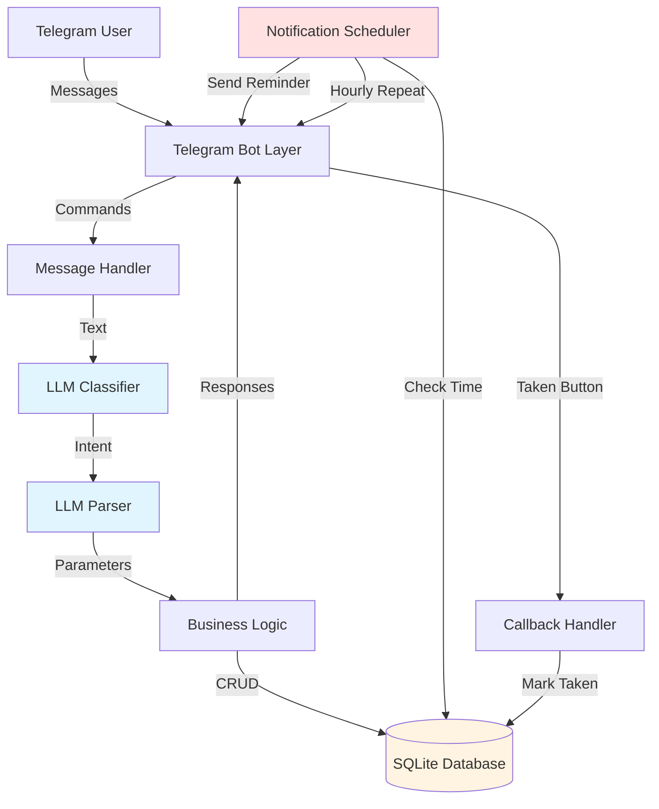
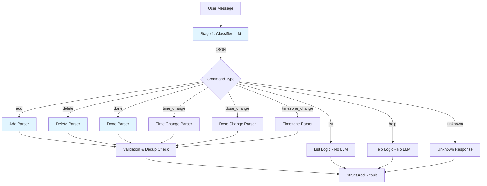
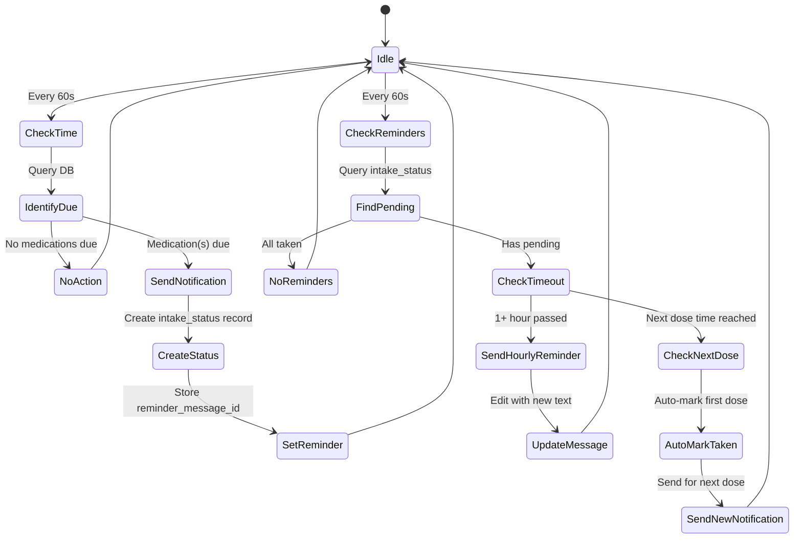
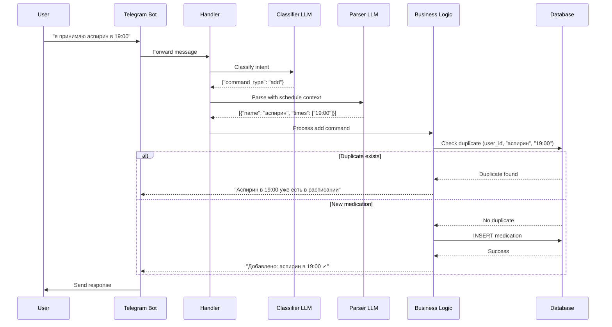
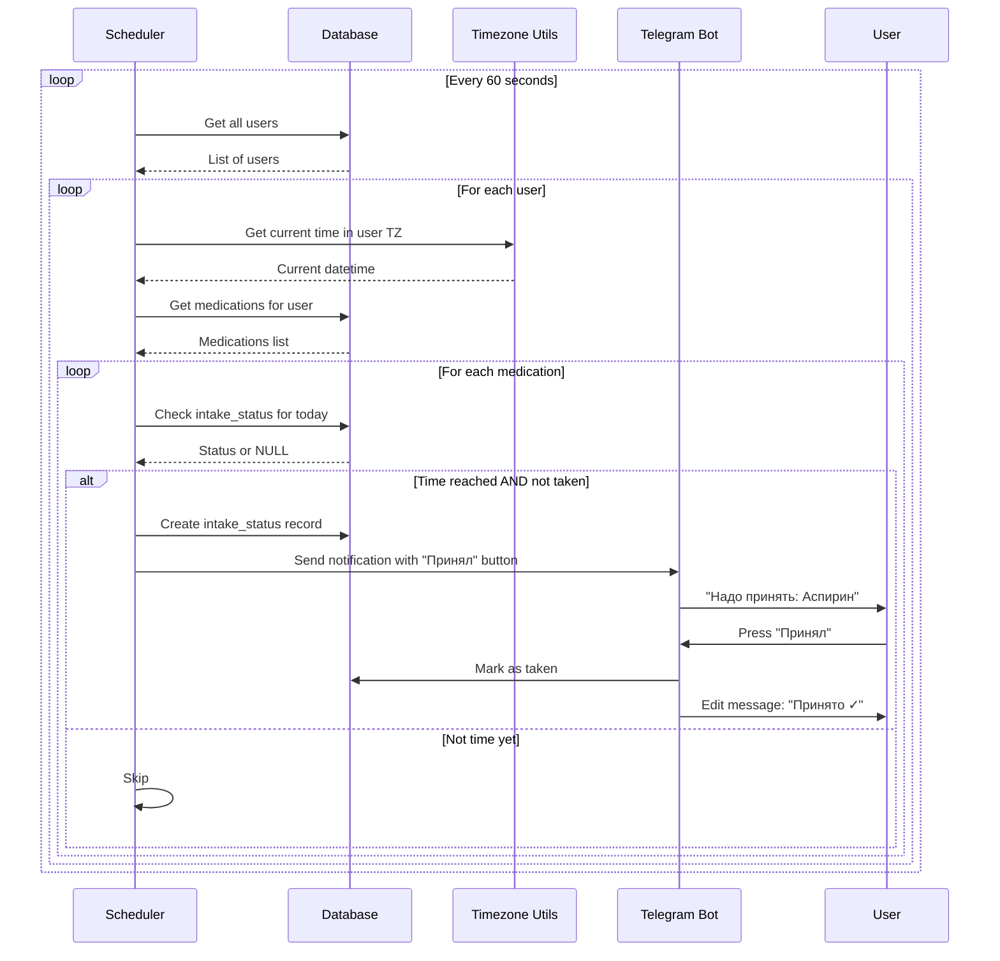
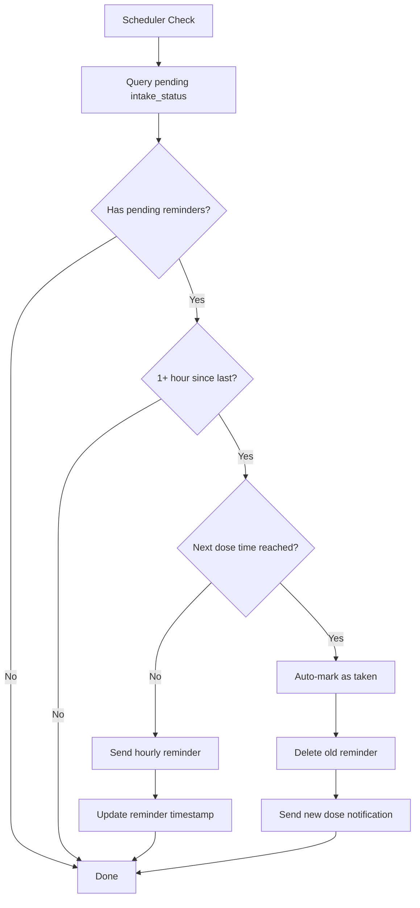

# Architecture: Telegram Medication Reminder Bot

## Executive Summary

This document describes the architecture for a Telegram bot that helps users manage medication reminders through natural language interaction. The system uses a two-stage LLM processing pipeline for command understanding, SQLite for data persistence, and implements a stateless, fault-tolerant notification system.

## System Overview

### Core Principles

1. **Natural Language Interface**: All user commands are processed through LLM, no traditional menu buttons
2. **Two-Stage LLM Processing**: Classifier → Parser for intent recognition and parameter extraction
3. **Stateless Fault Tolerance**: System recovers from downtime by analyzing database state
4. **Simple Architecture**: Pragmatic design without excessive OOP, one module per file
5. **Deduplication by Design**: Medication key = name + time

### Technology Stack

- **Language**: Python 3.11+
- **Bot Framework**: aiogram 3.15
- **Database**: SQLite3
- **LLM Provider**: Groq API
- **Async Runtime**: asyncio
- **Dependencies**: httpx, aiofiles, python-dotenv, loguru

---

## System Architecture

### High-Level Component Overview



---

## Module Structure

### 1. `settings.py` - Configuration Management

**Purpose**: Centralized configuration from environment variables

**Responsibilities**:
- Load `.env` file
- Validate required environment variables
- Provide typed access to configuration

**Configuration Parameters**:
```python
# Telegram
TELEGRAM_BOT_TOKEN: str (required)

# LLM (Groq)
GROQ_API_KEY: str (required)
GROQ_MODEL: str (default: "openai/gpt-oss-120b")
GROQ_TIMEOUT: int (default: 30)
GROQ_MAX_RETRIES: int (default: 3)

# Application
LOG_LEVEL: str (default: "INFO")
DATABASE_PATH: str (default: "data/medications.db")
SCHEDULER_INTERVAL_SECONDS: int (default: 60)
REMINDER_REPEAT_INTERVAL_HOURS: int (default: 1)
DEFAULT_TIMEZONE_OFFSET: str (default: "+03:00")
```

### 2. `database.py` - Data Persistence Layer

**Purpose**: SQLite database operations with proper schema design

**Responsibilities**:
- Database initialization and migrations
- CRUD operations for medications and intake status
- Transaction management
- Query optimization for scheduler

**Database Schema**:

```sql
-- Users table
CREATE TABLE users (
    user_id INTEGER PRIMARY KEY,
    timezone_offset TEXT NOT NULL,  -- e.g., "+03:00"
    created_at INTEGER NOT NULL,    -- Unix timestamp
    updated_at INTEGER NOT NULL     -- Unix timestamp
);

-- Medications table
CREATE TABLE medications (
    id INTEGER PRIMARY KEY AUTOINCREMENT,
    user_id INTEGER NOT NULL,
    name TEXT NOT NULL,              -- lowercase for consistency
    dosage TEXT,                     -- optional, e.g., "200 мг"
    time TEXT NOT NULL,              -- HH:MM format
    created_at INTEGER NOT NULL,
    
    -- Unique constraint: one medication per user per name+time
    UNIQUE(user_id, name, time),
    
    FOREIGN KEY (user_id) REFERENCES users(user_id) ON DELETE CASCADE
);

-- Intake status table
CREATE TABLE intake_status (
    id INTEGER PRIMARY KEY AUTOINCREMENT,
    user_id INTEGER NOT NULL,
    medication_id INTEGER NOT NULL,
    date TEXT NOT NULL,              -- YYYY-MM-DD in user's timezone
    taken_at INTEGER,                -- Unix timestamp when marked as taken
    reminder_message_id INTEGER,     -- Last reminder message ID
    
    -- One status per medication per day
    UNIQUE(user_id, medication_id, date),
    
    FOREIGN KEY (user_id) REFERENCES users(user_id) ON DELETE CASCADE,
    FOREIGN KEY (medication_id) REFERENCES medications(id) ON DELETE CASCADE
);

-- Indexes for performance
CREATE INDEX idx_medications_user_time ON medications(user_id, time);
CREATE INDEX idx_intake_status_user_date ON intake_status(user_id, date);
CREATE INDEX idx_intake_status_reminder ON intake_status(reminder_message_id) 
    WHERE reminder_message_id IS NOT NULL;
```

**Key Design Decisions**:
- `UNIQUE(user_id, name, time)` enforces deduplication at database level
- Intake status is per-day, not per-intake (simplified tracking)
- `reminder_message_id` tracks active reminders for deletion
- Timestamps in INTEGER for efficient storage and querying
- Cascade deletes ensure data consistency

### 3. `llm_client.py` - LLM API Adapter

**Purpose**: Abstract LLM provider communication

**Responsibilities**:
- HTTP client configuration (httpx)
- Request/response handling
- Error handling and retries
- Token usage tracking
- Streaming support (if needed)

**Interface**:
```python
class LLMClient:
    async def complete(
        self,
        system_prompt: str,
        user_message: str,
        temperature: float = 0.7,
        max_tokens: int = 500
    ) -> str:
        """Send completion request to LLM API"""
        
    async def complete_json(
        self,
        system_prompt: str,
        user_message: str
    ) -> dict:
        """Request JSON response and parse it"""
```

**Error Handling**:
- Retry with exponential backoff
- Timeout handling
- JSON parsing validation
- Fallback responses for critical paths

### 4. `llm_processor.py` - LLM Processing Logic

**Purpose**: Two-stage LLM pipeline for command processing

**Responsibilities**:
- Intent classification (first stage)
- Parameter extraction (second stage)
- Prompt management
- Response parsing and validation

**Processing Flow**:



**Command Processors**:

1. **add**: Extract medication name, times (multiple allowed), optional dosage
   - Returns: `List[{name, time, dosage}]`
   - Hard logic checks for duplicates (name + time)

2. **done**: Match medication by name and/or time
   - Loads user schedule with IDs
   - Returns: `{medication_ids: List[int], name: str, time: str|null}`
   - Handles group marking: "все что в 17 часов принял"

3. **delete**: Identify medications to remove
   - Returns: `{status: "success"|"clarification_needed"|"not_found", medication_ids: List[int]}`

4. **time_change**: Update medication time
   - Returns: `{medication_id: int, new_times: List[str]}`
   - Note: Multiple new times create separate medications

5. **dose_change**: Update dosage
   - Returns: `{medication_id: int, new_dosage: str}`

6. **timezone_change**: Parse timezone from city or offset
   - Returns: `{timezone_offset: str}`

7. **list**: Format schedule from database (no LLM)

8. **help**: Return predefined help message (no LLM)

9. **unknown**: Return "не понял" message

### 5. `telegram_bot.py` - Telegram Integration

**Purpose**: Telegram Bot API interaction

**Responsibilities**:
- Bot initialization and lifecycle
- Message routing
- Callback handling ("Taken" button)
- Message editing and deletion
- Error handling for Telegram API

**Message Handlers**:
```python
async def handle_message(message: Message):
    """Process incoming text message"""
    
async def handle_taken_callback(callback: CallbackQuery):
    """Handle "Taken" button press"""
```

**Button Implementation**:
- Only one interactive button: "Принял"
- Callback data format: `taken:{medication_id}:{date}`
- Updates intake_status table
- Edits message to show confirmation
- Stops all pending reminders for that medication

### 6. `scheduler.py` - Notification Scheduler

**Purpose**: Stateless notification and reminder system

**Responsibilities**:
- Periodic time checking (every 60 seconds)
- Identify medications due for notification
- Handle missed notifications after downtime
- Hourly reminder repeats
- Multi-dose medication logic

**Scheduling Logic**:



**Fault Tolerance - Missed Notifications**:

When bot restarts or experiences downtime:

1. Query all users and their medications
2. For each medication, check if notification was missed today
3. Identify missed notifications:
   - Medication time < current time
   - No intake_status record for today OR intake_status.taken_at IS NULL
4. Send all missed notifications immediately with "(пропущено)" marker
5. Start hourly reminders from current point

**Multi-Dose Medication Logic**:

Example: User takes "Aspirin" at 12:00 and 18:00

- 12:00: Send notification for aspirin (12:00)
- 12:30, 13:30, 14:30, ...: Hourly reminders for aspirin (12:00)
- 18:00: Check if 12:00 dose is taken:
  - If NOT taken: Auto-mark 12:00 as taken, delete old reminder
  - Send notification for aspirin (18:00)
- If ANY dose is marked "taken": Stop all reminders until next day

**Timezone Handling**:
- All times stored in user's local timezone
- Scheduler converts to user timezone for comparison
- Timezone changes update user record, don't modify medication times

### 7. `timezone_utils.py` - Timezone Management

**Purpose**: Timezone calculations and conversions

**Responsibilities**:
- Parse timezone offsets ("+03:00", "-05:00")
- Convert UTC to user local time
- Convert user local time to UTC
- Validate timezone formats
- Handle daylight saving time (manual offset changes by user)

**Functions**:
```python
def parse_timezone_offset(offset: str) -> timedelta:
    """Parse offset string to timedelta"""
    
def get_user_current_time(timezone_offset: str) -> datetime:
    """Get current time in user's timezone"""
    
def is_time_to_send_notification(
    medication_time: str,
    current_time: datetime,
    last_sent_date: str | None
) -> bool:
    """Check if it's time to send notification"""
    
def should_send_hourly_reminder(
    reminder_sent_at: int,
    current_timestamp: int,
    interval_hours: int = 1
) -> bool:
    """Check if hourly reminder should be sent"""
```

---

## Data Flow Diagrams

### Message Processing Flow



### Notification Flow



### Hourly Reminder Flow



---

## Command Processing Workflows

### ADD Command

**Input**: "я принимаю аспирин в 19:00"

**Processing**:
1. Classifier → `add`
2. Parser → `[{"name": "аспирин", "times": ["19:00"], "dosage": null}]`
3. For each medication in list:
   - Check duplicate: `SELECT COUNT(*) FROM medications WHERE user_id=? AND name=? AND time=?`
   - If exists: Return error message
   - If not: `INSERT INTO medications ...`
4. Return confirmation: "Добавлено: аспирин в 19:00 ✓"

**Edge Cases**:
- Multiple times: Create separate records
- Multiple medications: Process each independently
- Duplicate: Reject with message "уже есть в расписании"

### DONE Command

**Input**: "я принял аспирин"

**Processing**:
1. Classifier → `done`
2. Load user schedule: `SELECT id, name, dosage, time FROM medications WHERE user_id=?`
3. Parser with schedule → `{"medication_ids": [1, 3], "name": "Аспирин", "time": null}`
4. For each medication_id:
   - `UPDATE intake_status SET taken_at=? WHERE medication_id=? AND date=?`
   - If reminder_message_id exists: Edit message to show "Принято ✓"
5. Return confirmation with LLM-generated message

**Edge Cases**:
- Multiple medications with same name: Mark all
- Time specified: Match specific medication
- Not found: "Аспирин не найден в расписании"

### DELETE Command

**Input**: "удали аспирин"

**Processing**:
1. Classifier → `delete`
2. Load user schedule
3. Parser → `{"status": "success", "medication_ids": [1, 3], "medication_name": "Аспирин"}`
4. If status is "clarification_needed": Return parser's message
5. If status is "not_found": Return "медикамент не найден"
6. If status is "success": 
   - `DELETE FROM medications WHERE id IN (...)`
   - Return "Аспирин удален из расписания"

### TIME_CHANGE Command

**Input**: "измени время аспирина на 20:00"

**Processing**:
1. Classifier → `time_change`
2. Load user schedule
3. Parser → `{"medication_id": 1, "new_times": ["20:00"], "medication_name": "аспирина"}`
4. For single new time:
   - `UPDATE medications SET time=? WHERE id=?`
5. For multiple new times:
   - Delete old medication
   - Create new medications with new times
6. Return "Время приема аспирина изменено на 20:00"

### LIST Command

**Input**: "что я принимаю"

**Processing**:
1. Classifier → `list`
2. Query: `SELECT name, dosage, time FROM medications WHERE user_id=? ORDER BY time`
3. Format response (no LLM):
```
Ваше расписание:
• 10:00 - Аспирин (200 мг)
• 19:00 - Парацетамол
```

---

## Fault Tolerance and Recovery

### Recovery After Downtime

**Scenario**: Bot was offline from 10:00 to 15:00

**Recovery Process**:
1. Bot starts at 15:00
2. Scheduler runs first check
3. For each user:
   - Get current time in user's timezone
   - Query medications with `time <= current_time`
   - Filter: no intake_status for today OR taken_at IS NULL
4. Send all missed notifications with marker "(пропущено)"
5. Continue normal operation

**Example**:
```
User has medications at:
- Aspirin at 12:00 (missed)
- Paracetamol at 18:00 (not yet)

At 15:00 restart:
→ Send: "Надо принять (пропущено): Aspirin"
→ Start hourly reminders for Aspirin
→ At 18:00: Send notification for Paracetamol
```

### Database Consistency

**Atomic Operations**:
- Use SQLite transactions for multi-step operations
- `BEGIN TRANSACTION` → operations → `COMMIT` or `ROLLBACK`

**Concurrent Access**:
- SQLite handles locking automatically
- Use WAL mode for better concurrency: `PRAGMA journal_mode=WAL`
- Async operations with `aiosqlite` library

**Backup Strategy** (optional for production):
- Daily backup of SQLite file
- Backup before migrations

---

## API Integration Points

### Groq LLM API

**Endpoint**: `https://api.groq.com/openai/v1/chat/completions`

**Request Format**:
```json
{
  "model": "openai/gpt-oss-120b",
  "messages": [
    {"role": "system", "content": "system prompt from prompts.py"},
    {"role": "user", "content": "user message"}
  ],
  "temperature": 0.7,
  "max_tokens": 500,
  "response_format": {"type": "json_object"}
}
```

**Response Handling**:
- Success: Parse JSON from `choices[0].message.content`
- Rate limit: Retry with exponential backoff
- Timeout: Use fallback responses for critical paths
- Invalid JSON: Log error and request re-parse or use fallback

### Telegram Bot API

**Library**: aiogram 3.15

**Key Methods**:
- `bot.send_message()`: Send notifications
- `bot.edit_message_text()`: Update reminder message
- `bot.delete_message()`: Remove old reminders
- `bot.answer_callback_query()`: Respond to button presses

**Webhook vs Polling**: Use polling for simplicity (no need for public server)

---

## Error Handling Strategy

### LLM Errors

1. **Timeout**: Retry up to 3 times, then fallback response
2. **Invalid JSON**: Log and ask user to rephrase
3. **Rate Limit**: Exponential backoff (1s, 2s, 4s)
4. **API Down**: Cache critical prompts for offline operation

### Database Errors

1. **Lock Timeout**: Retry with random delay
2. **Corruption**: Restore from backup (if available)
3. **Disk Full**: Alert and graceful degradation

### Telegram Errors

1. **Message Too Long**: Split into multiple messages
2. **User Blocked Bot**: Mark in database, skip notifications
3. **Message Not Found**: Ignore (already deleted)

---

## Performance Considerations

### Database Optimization

- **Indexes**: On (user_id, time) and (user_id, date)
- **Query Batching**: Load all medications per user at once
- **Connection Pooling**: Use aiosqlite connection pool

### LLM Optimization

- **Prompt Caching**: Reuse system prompts
- **Batch Processing**: Not applicable (real-time interaction)
- **Model Selection**: Balance between speed and accuracy

### Memory Management

- **Stateless Design**: No in-memory state between restarts
- **Lazy Loading**: Load user data only when needed
- **Stream Processing**: Process users one by one in scheduler

---

## Security Considerations

1. **Environment Variables**: Never commit `.env` file
2. **SQL Injection**: Use parameterized queries (always)
3. **User Input Validation**: Validate time format, timezone offset
4. **API Keys**: Rotate periodically
5. **User Privacy**: No shared data between users

---

## Testing Strategy

### Unit Tests

- Database operations (CRUD)
- Timezone calculations
- LLM response parsing
- Deduplication logic

### Integration Tests

- Full command flows (add, delete, done, etc.)
- Notification scheduling
- Recovery after downtime
- Multi-dose medication scenarios

### LLM Tests

- Intent classification accuracy
- Parameter extraction correctness
- Edge case handling

Existing test coverage in `/tests/integration/` provides good baseline.

---

## Deployment and Operations

### Environment Setup

```bash
# Install dependencies
pip install -r requirements.txt

# Setup database
python -m src.database init

# Run bot
python -m src.main
```

### Monitoring

- Log levels: DEBUG for development, INFO for production
- Key metrics:
  - Notification success rate
  - LLM response time
  - Database query time
  - User active count

### Maintenance

- Database vacuum: Weekly VACUUM command
- Log rotation: Keep last 7 days
- Backup: Daily `.db` file backup

---

## Future Enhancements (Out of Scope)

1. **Period Field**: Support for medications not taken daily
2. **Web Dashboard**: View schedule in browser
3. **Multiple Reminders**: More than hourly repeats
4. **Analytics**: Track adherence rates
5. **Photo Recognition**: Scan medication labels
6. **Multi-language**: Support other languages

---

## Implementation Phases

### Phase 1: Core Foundation (Week 1)
- Database schema and basic CRUD
- Settings and configuration
- Timezone utilities
- Basic Telegram bot setup

### Phase 2: LLM Integration (Week 1-2)
- LLM client implementation
- Prompt engineering
- Classifier and parsers
- Command processing logic

### Phase 3: Notification System (Week 2)
- Scheduler implementation
- Notification sending
- Hourly reminders
- Button handling

### Phase 4: Advanced Features (Week 2-3)
- Multi-dose medication logic
- Fault tolerance and recovery
- Error handling
- Edge case handling

### Phase 5: Testing and Polish (Week 3)
- Integration tests
- LLM accuracy testing
- Bug fixes
- Documentation

---

## Conclusion

This architecture provides a solid foundation for a medication reminder bot with natural language understanding. The stateless, fault-tolerant design ensures reliability without complex state management. The two-stage LLM pipeline balances flexibility with predictability.

Key strengths:
- Simple, maintainable codebase
- Robust error handling
- Recovers gracefully from downtime
- Natural language interface

The design prioritizes pragmatism over perfection, suitable for a personal project without enterprise requirements.
