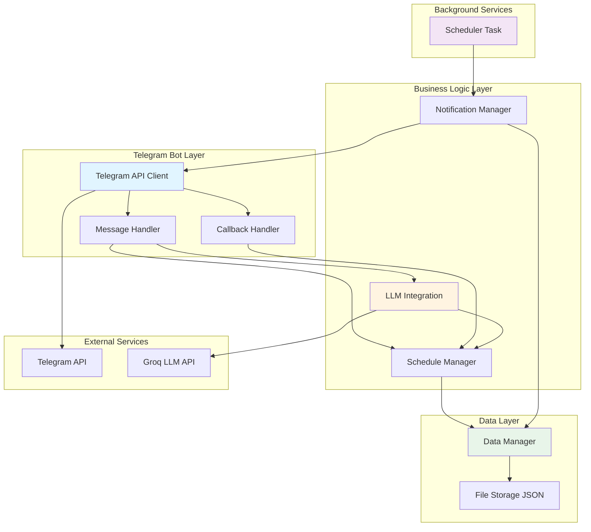

# Архитектура Telegram-бота для управления приемом медикаментов

## Оглавление
1. [Обзор системы](#обзор-системы)
2. [Архитектура компонентов](#архитектура-компонентов)
3. [Формальная спецификация данных](#формальная-спецификация-данных)
4. [Модули системы](#модули-системы)
5. [Интеграция с Groq LLM](#интеграция-с-groq-llm)
6. [Система напоминаний](#система-напоминаний)
7. [Обработка ошибок](#обработка-ошибок)
8. [Развертывание и конфигурация](#развертывание-и-конфигурация)

---

## Обзор системы

### Назначение
Telegram-бот для автоматизации управления расписанием приема медикаментов с поддержкой:
- Естественноязыковых команд через LLM
- Автоматических напоминаний
- Гибких схем приема (фиксированное время и интервалы)
- Простой логики: один прием закрывает все пропущенные

### Технологический стек
- **Python 3.11+**
- **aiogram 3.x** - Telegram Bot API
- **python-dotenv** - управление конфигурацией
- **loguru** - структурированное логирование
- **httpx** - асинхронные HTTP-запросы к Groq API
- **pytz** - работа с временными зонами
- **asyncio** - асинхронная обработка

---

## Архитектура компонентов



### Описание компонентов

#### 1. Telegram Bot Layer
- **Telegram API Client**: Обработка входящих сообщений и отправка уведомлений
- **Message Handler**: Маршрутизация текстовых команд
- **Callback Handler**: Обработка нажатий inline-кнопок

#### 2. Business Logic Layer
- **Schedule Manager**: CRUD операции над расписаниями медикаментов
- **Notification Manager**: Формирование и отправка напоминаний
- **LLM Integration**: Обработка естественноязыковых команд

#### 3. Data Layer
- **Data Manager**: Абстракция работы с хранилищем
- **File Storage**: JSON-файлы для персистентности

#### 4. Background Services
- **Scheduler Task**: Фоновый процесс проверки времени приема

---

## Формальная спецификация данных

### Структура JSON файла пользователя

**Путь**: `data/users/{user_id}.json`

```json
{
  "user_id": 123456789,
  "timezone": "Europe/Moscow",
  "medications": [
    {
      "medication_id": "med_1703701234567",
      "name": "Аспирин",
      "dosage": "100 мг",
      "schedule_type": "fixed_times",
      "schedule": {
        "times": [
          {"hour": 9, "minute": 0},
          {"hour": 21, "minute": 0}
        ]
      },
      "last_taken": "2024-12-27T18:00:00Z",
      "next_planned_time": "2024-12-28T06:00:00Z",
      "last_reminder_message_id": 12345,
      "active": true,
      "created_at": "2024-12-01T10:00:00Z",
      "updated_at": "2024-12-27T18:00:00Z"
    },
    {
      "medication_id": "med_1703701234568",
      "name": "Витамин D",
      "dosage": "2000 МЕ",
      "schedule_type": "interval",
      "schedule": {
        "interval_hours": 24
      },
      "last_taken": "2024-12-27T08:30:00Z",
      "next_planned_time": "2024-12-28T08:30:00Z",
      "last_reminder_message_id": null,
      "active": true,
      "created_at": "2024-12-15T10:00:00Z",
      "updated_at": "2024-12-27T08:30:00Z"
    }
  ]
}
```

### Описание полей

#### Корневой уровень
| Поле | Тип | Обязательное | Описание |
|------|-----|--------------|----------|
| `user_id` | integer | Да | Telegram user ID |
| `timezone` | string | Да | IANA timezone (например, "Europe/Moscow") |
| `medications` | array | Да | Список медикаментов пользователя |

#### Medication Object
| Поле | Тип | Обязательное | Описание |
|------|-----|--------------|----------|
| `medication_id` | string | Да | Уникальный идентификатор (формат: "med_{timestamp}") |
| `name` | string | Да | Название препарата |
| `dosage` | string | Да | Дозировка (свободный формат) |
| `schedule_type` | enum | Да | Тип расписания: "fixed_times" или "interval" |
| `schedule` | object | Да | Объект расписания (структура зависит от schedule_type) |
| `last_taken` | string/null | Да | ISO 8601 timestamp фактического приема (UTC) |
| `next_planned_time` | string | Да | ISO 8601 timestamp следующего планового приема (UTC) |
| `last_reminder_message_id` | integer/null | Да | ID последнего сообщения-напоминания |
| `active` | boolean | Да | Активен ли медикамент (для мягкого удаления) |
| `created_at` | string | Да | ISO 8601 timestamp создания записи (UTC) |
| `updated_at` | string | Да | ISO 8601 timestamp последнего обновления (UTC) |

#### Schedule Object (fixed_times)
```json
{
  "times": [
    {"hour": 9, "minute": 0},
    {"hour": 14, "minute": 30},
    {"hour": 21, "minute": 0}
  ]
}
```

| Поле | Тип | Описание |
|------|-----|----------|
| `times` | array | Массив объектов времени приема |
| `times[].hour` | integer | Час (0-23) |
| `times[].minute` | integer | Минута (0-59) |

#### Schedule Object (interval)
```json
{
  "interval_hours": 8
}
```

| Поле | Тип | Описание |
|------|-----|----------|
| `interval_hours` | integer/float | Интервал между приемами в часах |

---

## Модули системы

### 1. Data Manager (`src/data_manager.py`)

#### Класс: `DataManager`

**Назначение**: Управление чтением/записью данных пользователей с атомарностью и изоляцией.

**Методы**:

```python
class DataManager:
    def __init__(self, data_dir: str = "data/users"):
        """Инициализация менеджера данных."""
        
    async def get_user_data(self, user_id: int) -> dict:
        """Получить данные пользователя. Создает новый файл если не существует."""
        
    async def save_user_data(self, user_id: int, data: dict) -> bool:
        """Атомарно сохранить данные пользователя."""
        
    async def add_medication(self, user_id: int, medication: dict) -> str:
        """Добавить медикамент. Возвращает medication_id."""
        
    async def update_medication(self, user_id: int, medication_id: str, updates: dict) -> bool:
        """Обновить поля медикамента."""
        
    async def delete_medication(self, user_id: int, medication_id: str) -> bool:
        """Мягкое удаление медикамента (active=false)."""
        
    async def get_medication(self, user_id: int, medication_id: str) -> dict | None:
        """Получить конкретный медикамент."""
        
    async def get_all_active_medications(self, user_id: int) -> list[dict]:
        """Получить все активные медикаменты пользователя."""
        
    async def mark_taken(self, user_id: int, medication_id: str, taken_at: datetime) -> bool:
        """Отметить прием медикамента и пересчитать next_planned_time."""
        
    async def get_all_users(self) -> list[int]:
        """Получить список всех user_id."""
```

**Особенности реализации**:
- Атомарная запись через временный файл + `os.replace()`
- Блокировка файлов через `asyncio.Lock` по user_id
- Автоматическое создание директорий
- Валидация JSON схемы при загрузке
- Резервное копирование перед перезаписью

---

### 2. Schedule Manager (`src/schedule_manager.py`)

#### Класс: `ScheduleManager`

**Назначение**: Бизнес-логика управления расписаниями.

**Методы**:

```python
class ScheduleManager:
    def __init__(self, data_manager: DataManager):
        """Инициализация с зависимостью от DataManager."""
        
    async def calculate_next_planned_time(
        self, 
        medication: dict, 
        user_timezone: str,
        from_time: datetime | None = None
    ) -> datetime:
        """Рассчитать следующее плановое время приема."""
        
    async def get_pending_medications(
        self, 
        user_id: int, 
        current_time: datetime
    ) -> list[dict]:
        """Получить медикаменты, время приема которых наступило."""
        
    async def update_schedule_from_llm(
        self, 
        user_id: int, 
        llm_response: dict
    ) -> dict:
        """Применить изменения расписания из ответа LLM."""
```

**Логика расчета next_planned_time**:

#### Для fixed_times

```python
async def calculate_next_planned_time_fixed(
    self,
    medication: dict,
    user_timezone: str,
    from_time: datetime
) -> datetime:
    """Рассчитать следующее плановое время для fixed_times."""
    
    user_tz = pytz.timezone(user_timezone)
    local_from = from_time.astimezone(user_tz)
    
    times = medication['schedule']['times']
    
    # Найти следующее время из списка
    for time_obj in times:
        next_time = local_from.replace(
            hour=time_obj['hour'],
            minute=time_obj['minute'],
            second=0,
            microsecond=0
        )
        
        if next_time > local_from:
            return next_time.astimezone(timezone.utc)
    
    # Если все времена сегодня прошли, взять первое время завтра
    next_time = (local_from + timedelta(days=1)).replace(
        hour=times[0]['hour'],
        minute=times[0]['minute'],
        second=0,
        microsecond=0
    )
    
    return next_time.astimezone(timezone.utc)
```

#### Для interval

```python
async def calculate_next_planned_time_interval(
    self,
    medication: dict,
    user_timezone: str,
    from_time: datetime
) -> datetime:
    """Рассчитать следующее плановое время для interval."""
    
    interval_hours = medication['schedule']['interval_hours']
    
    # Просто добавить интервал к from_time
    next_time = from_time + timedelta(hours=interval_hours)
    
    return next_time
```

#### Логика раннего приема

Если пользователь принял лекарство **раньше** планового времени, следующий плановый прием **пропускается**.

```python
async def mark_taken(self, user_id: int, medication_id: str, taken_at: datetime) -> bool:
    """Отметить прием медикамента."""
    
    user_data = await self.get_user_data(user_id)
    medication = next((m for m in user_data['medications'] if m['medication_id'] == medication_id), None)
    
    if not medication:
        return False
    
    # Обновить last_taken
    medication['last_taken'] = taken_at.isoformat()
    
    # Рассчитать следующий плановый прием от времени фактического приема
    next_planned = await self.schedule_manager.calculate_next_planned_time(
        medication,
        user_data['timezone'],
        from_time=taken_at
    )
    
    # Если принял раньше планового времени, пропускаем следующий плановый прием
    current_planned = datetime.fromisoformat(medication['next_planned_time'])
    if taken_at < current_planned:
        # Пропускаем один прием - берем следующий после next_planned
        next_planned = await self.schedule_manager.calculate_next_planned_time(
            medication,
            user_data['timezone'],
            from_time=next_planned
        )
    
    medication['next_planned_time'] = next_planned.isoformat()
    medication['last_reminder_message_id'] = None  # Сбросить напоминание
    medication['updated_at'] = datetime.now(timezone.utc).isoformat()
    
    await self.save_user_data(user_id, user_data)
    return True
```

**Пример**:
```
Расписание: Аспирин каждые 8 часов (08:00, 16:00, 00:00)

Сценарий:
- 08:00 - плановый прием
- 07:30 - пользователь принял раньше
- 16:00 - ПРОПУСКАЕМ этот прием
- 00:00 - следующее напоминание
```

#### Логика пропущенных приемов

Храним только **последний пропущенный прием**. Один прием закрывает все пропущенные.

```python
async def get_pending_medications(
    self, 
    user_id: int, 
    current_time: datetime
) -> list[dict]:
    """Получить медикаменты, требующие напоминания."""
    
    user_data = await self.data_manager.get_user_data(user_id)
    pending = []
    
    for med in user_data['medications']:
        if not med['active']:
            continue
            
        next_planned = datetime.fromisoformat(med['next_planned_time'])
        
        # Простое условие: время приема наступило и медикамент не принят
        if next_planned <= current_time:
            last_taken = med.get('last_taken')
            
            # Если не принимали вообще или последний прием был до планового времени
            if last_taken is None or datetime.fromisoformat(last_taken) < next_planned:
                pending.append(med)
    
    # Сортировать по next_planned_time
    pending.sort(key=lambda m: m['next_planned_time'])
    
    return pending
```

**Пример**:
```
Расписание: Витамин D каждый день в 09:00

Сценарий:
- 27.12 09:00 - пропущен
- 28.12 09:00 - пропущен  
- 29.12 09:00 - пропущен
- 29.12 10:00 - пользователь принял

Результат: Все 3 пропущенных приема закрыты одним приемом
Следующее напоминание: 30.12 09:00
```

---

### 3. Notification Manager (`src/notification_manager.py`)

#### Класс: `NotificationManager`

**Назначение**: Формирование и отправка напоминаний.

**Методы**:

```python
class NotificationManager:
    def __init__(self, bot: Bot, schedule_manager: ScheduleManager):
        """Инициализация с зависимостями."""
        
    async def send_reminder(
        self, 
        user_id: int, 
        medications: list[dict]
    ) -> int | None:
        """Отправить напоминание. Возвращает message_id."""
        
    async def update_reminder(
        self, 
        user_id: int, 
        message_id: int, 
        medications: list[dict]
    ) -> bool:
        """Обновить существующее напоминание."""
        
    async def delete_reminder(
        self, 
        user_id: int, 
        message_id: int
    ) -> bool:
        """Удалить напоминание."""
        
    def build_reminder_text(self, medications: list[dict]) -> str:
        """Сформировать текст напоминания."""
        
    def build_inline_keyboard(
        self, 
        medications: list[dict]
    ) -> InlineKeyboardMarkup:
        """Создать inline-клавиатуру с кнопками для каждого медикамента."""
```

**Формат текста напоминания**:
```
💊 Время принять лекарства:

• Аспирин 100 мг
• Витамин D 2000 МЕ
```

**Формат callback_data**:
```
take:{medication_id}
```

**Логика обновления напоминаний**:
1. При отправке нового напоминания удалить предыдущее (если `last_reminder_message_id` не null)
2. При нажатии кнопки:
   - Удалить кнопку принятого медикамента
   - Если все кнопки удалены, заменить сообщение на "✅ Все принято!"
3. Если есть непринятые медикаменты, обновлять существующее сообщение (не создавать новое)

---

### 4. LLM Integration (`src/llm_integration.py`)

#### Класс: `LLMIntegration`

**Назначение**: Обработка естественноязыковых команд через Groq API.

**Методы**:

```python
class LLMIntegration:
    def __init__(self, api_key: str):
        """Инициализация с API ключом."""
        
    async def parse_schedule_command(
        self, 
        user_id: int,
        current_schedule: dict,
        user_message: str,
        user_timezone: str
    ) -> dict:
        """Обработать команду редактирования расписания."""
```

**Формат промпта**:

```python
system_prompt = f"""
Ты - ассистент для управления расписанием приема медикаментов.

ТЕКУЩЕЕ РАСПИСАНИЕ ПОЛЬЗОВАТЕЛЯ:
{json.dumps(current_schedule, ensure_ascii=False, indent=2)}

ВРЕМЕННАЯ ЗОНА ПОЛЬЗОВАТЕЛЯ: {user_timezone}
ТЕКУЩЕЕ ВРЕМЯ: {current_time_str}

ПОДДЕРЖИВАЕМЫЕ ОПЕРАЦИИ:
1. Добавление нового медикамента
2. Изменение времени приема
3. Изменение дозировки
4. Удаление медикамента
5. Изменение типа расписания (фиксированное время / интервал)

ТИПЫ РАСПИСАНИЙ:

1. ФИКСИРОВАННОЕ ВРЕМЯ (fixed_times):
   - Используется для медикаментов с конкретными временами приема
   - Примеры: "утром и вечером", "в 9:00, 14:00 и 21:00", "3 раза в день"
   - Формат: {{"times": [{{"hour": 9, "minute": 0}}, {{"hour": 21, "minute": 0}}]}}

2. ИНТЕРВАЛ (interval):
   - Используется для медикаментов с приемом "каждые N часов"
   - Примеры: "каждые 8 часов", "каждые 6 часов", "раз в сутки"
   - Формат: {{"interval_hours": 8}}

ВАЖНЫЕ ПРАВИЛА:
- Если пользователь принял лекарство раньше времени, следующий плановый прием пропускается
- Один прием закрывает все пропущенные приемы
- Пользователь сам контролирует, когда читать сообщения

ФОРМАТ ОТВЕТА (строгий JSON):
{{
  "action": "add" | "update" | "delete" | "error",
  "medication_id": "med_xxx" или null для новых,
  "changes": {{
    "name": "Название препарата",
    "dosage": "100 мг",
    "schedule_type": "fixed_times" | "interval",
    "schedule": {{
      // Для fixed_times:
      "times": [{{"hour": 9, "minute": 0}}]
      // Для interval:
      "interval_hours": 24
    }}
  }},
  "confirmation_message": "Текст подтверждения для пользователя",
  "error_message": null или "Описание ошибки"
}}

ПРИМЕРЫ:

Команда: "Добавь аспирин 100 мг утром и вечером"
Ответ: {{
  "action": "add",
  "medication_id": null,
  "changes": {{
    "name": "Аспирин",
    "dosage": "100 мг",
    "schedule_type": "fixed_times",
    "schedule": {{"times": [{{"hour": 9, "minute": 0}}, {{"hour": 21, "minute": 0}}]}}
  }},
  "confirmation_message": "Добавлен Аспирин 100 мг, прием в 09:00 и 21:00",
  "error_message": null
}}

Команда: "Добавь антибиотик каждые 8 часов"
Ответ: {{
  "action": "add",
  "medication_id": null,
  "changes": {{
    "name": "Антибиотик",
    "dosage": "по назначению врача",
    "schedule_type": "interval",
    "schedule": {{"interval_hours": 8}}
  }},
  "confirmation_message": "Добавлен Антибиотик, прием каждые 8 часов",
  "error_message": null
}}

Return ONLY the JSON object without any additional text or explanation.
"""
```

**Формат ответа LLM**:

```json
{
  "action": "add",
  "medication_id": null,
  "changes": {
    "name": "Омега-3",
    "dosage": "1000 мг",
    "schedule_type": "fixed_times",
    "schedule": {
      "times": [{"hour": 9, "minute": 0}]
    }
  },
  "confirmation_message": "Добавлен Омега-3 1000 мг, прием каждый день в 09:00",
  "error_message": null
}
```

**Обработка ошибок**:
- Timeout (30 секунд) → retry 2 раза с exponential backoff
- HTTP 429 (rate limit) → retry через время из заголовка Retry-After
- HTTP 5xx → retry 3 раза
- Невалидный JSON → запросить уточнение у пользователя
- action="error" → отправить error_message пользователю

---

### 5. Scheduler Task (`src/scheduler.py`)

#### Класс: `MedicationScheduler`

**Назначение**: Фоновый процесс проверки времени приема и отправки напоминаний.

**Методы**:

```python
class MedicationScheduler:
    def __init__(
        self, 
        data_manager: DataManager,
        schedule_manager: ScheduleManager,
        notification_manager: NotificationManager
    ):
        """Инициализация с зависимостями."""
        
    async def start(self):
        """Запустить фоновую задачу."""
        
    async def stop(self):
        """Остановить фоновую задачу."""
        
    async def check_and_notify(self):
        """Основной цикл проверки (вызывается каждую минуту)."""
        
    async def process_user(self, user_id: int):
        """Обработать расписание одного пользователя."""
```

**Алгоритм check_and_notify (упрощенный)**:

```python
async def check_and_notify(self):
    """Основной цикл проверки (вызывается каждую минуту)."""
    
    current_time = datetime.now(timezone.utc)
    all_users = await self.data_manager.get_all_users()
    
    # Обработать каждого пользователя параллельно
    tasks = [self.process_user(user_id, current_time) for user_id in all_users]
    await asyncio.gather(*tasks, return_exceptions=True)


async def process_user(self, user_id: int, current_time: datetime):
    """Обработать расписание одного пользователя."""
    
    try:
        # Получить медикаменты, требующие напоминания
        pending_meds = await self.schedule_manager.get_pending_medications(
            user_id, 
            current_time
        )
        
        if not pending_meds:
            return
        
        # Проверить, есть ли активное напоминание
        active_reminder_id = None
        for med in pending_meds:
            if med.get('last_reminder_message_id'):
                active_reminder_id = med['last_reminder_message_id']
                break
        
        if active_reminder_id:
            # Обновить существующее напоминание
            await self.notification_manager.update_reminder(
                user_id, 
                active_reminder_id, 
                pending_meds
            )
        else:
            # Отправить новое напоминание
            message_id = await self.notification_manager.send_reminder(
                user_id, 
                pending_meds
            )
            
            # Сохранить message_id для всех медикаментов
            for med in pending_meds:
                await self.data_manager.update_medication(
                    user_id,
                    med['medication_id'],
                    {'last_reminder_message_id': message_id}
                )
                
    except Exception as e:
        logger.error(f"Error processing user {user_id}: {e}", exc_info=True)
```

**Частота проверки**: Каждую минуту

---

### 6. Callback Handler (`src/handlers/callback_handler.py`)

#### Обработчик: `handle_take_medication`

**Назначение**: Обработка нажатий inline-кнопок подтверждения приема.

```python
@router.callback_query(F.data.startswith("take:"))
async def handle_take_medication(
    callback: CallbackQuery,
    data_manager: DataManager,
    schedule_manager: ScheduleManager,
    notification_manager: NotificationManager
):
    """Обработать подтверждение приема медикамента."""
    
    # Парсинг callback_data
    medication_id = callback.data.split(":")[1]
    user_id = callback.from_user.id
    taken_at = datetime.now(timezone.utc)
    
    try:
        # Отметить прием
        success = await data_manager.mark_taken(user_id, medication_id, taken_at)
        
        if not success:
            await callback.answer("❌ Ошибка при сохранении", show_alert=True)
            return
        
        # Получить обновленный список непринятых медикаментов из этого напоминания
        user_data = await data_manager.get_user_data(user_id)
        message_id = callback.message.message_id
        
        remaining_meds = [
            med for med in user_data['medications']
            if med.get('last_reminder_message_id') == message_id
            and med.get('last_taken') is None
            and med['active']
        ]
        
        if remaining_meds:
            # Обновить клавиатуру (убрать кнопку принятого медикамента)
            await notification_manager.update_reminder(
                user_id,
                message_id,
                remaining_meds
            )
            await callback.answer("✅ Отмечено")
        else:
            # Все медикаменты приняты - заменить сообщение
            await callback.message.edit_text(
                "✅ Все лекарства приняты!",
                reply_markup=None
            )
            await callback.answer("✅ Все принято!")
            
    except Exception as e:
        logger.error(f"Error handling take callback: {e}", exc_info=True)
        await callback.answer("❌ Произошла ошибка", show_alert=True)
```

---

## Интеграция с Groq LLM

### Конфигурация

```python
# src/config.py
from pydantic_settings import BaseSettings

class Settings(BaseSettings):
    telegram_bot_token: str
    groq_api_key: str
    groq_model: str = "openai/gpt-oss-120b"
    groq_timeout: int = 30
    groq_max_retries: int = 3
    
    class Config:
        env_file = ".env"
        env_file_encoding = "utf-8"
```

### Retry-логика для Groq API

```python
async def make_llm_request_with_retry(
    self,
    messages: list[dict],
    max_retries: int = 3
) -> dict | None:
    """Выполнить запрос к LLM с retry-логикой."""
    
    for attempt in range(max_retries):
        try:
            async with httpx.AsyncClient(timeout=30.0) as client:
                response = await client.post(
                    "https://api.groq.com/openai/v1/chat/completions",
                    headers={
                        "Authorization": f"Bearer {self.api_key}",
                        "Content-Type": "application/json"
                    },
                    json={
                        "model": self.model,
                        "messages": messages,
                        "temperature": 0.3,
                        "response_format": {"type": "json_object"}
                    }
                )
                
                if response.status_code == 200:
                    return response.json()
                    
                elif response.status_code == 429:
                    # Rate limit - ждем время из заголовка
                    retry_after = int(response.headers.get("Retry-After", 60))
                    logger.warning(f"Rate limit hit, waiting {retry_after}s")
                    await asyncio.sleep(retry_after)
                    continue
                    
                elif response.status_code >= 500:
                    # Server error - exponential backoff
                    wait_time = 2 ** attempt
                    logger.warning(f"Server error {response.status_code}, retry in {wait_time}s")
                    await asyncio.sleep(wait_time)
                    continue
                    
                else:
                    # Client error - не retry
                    logger.error(f"LLM API error {response.status_code}: {response.text}")
                    return None
                    
        except httpx.TimeoutException:
            wait_time = 2 ** attempt
            logger.warning(f"Request timeout, retry {attempt+1}/{max_retries} in {wait_time}s")
            await asyncio.sleep(wait_time)
            continue
            
        except Exception as e:
            logger.error(f"Unexpected error in LLM request: {e}", exc_info=True)
            return None
    
    logger.error(f"All {max_retries} retry attempts failed")
    return None
```

---

## Система напоминаний

### Сценарии использования

#### Сценарий 1: Обычный прием

```
09:00 - Напоминание: "💊 Аспирин 100 мг"
09:05 - Пользователь нажимает "Принял"
21:00 - Следующее напоминание
```

#### Сценарий 2: Ранний прием

```
08:30 - Пользователь нажимает "Принял" (раньше 09:00)
09:00 - Напоминание НЕ отправляется (пропущено)
21:00 - Следующее напоминание
```

#### Сценарий 3: Пропущенные приемы

```
27.12 09:00 - Напоминание отправлено, не прочитано
28.12 09:00 - Напоминание обновлено (тот же message)
29.12 09:00 - Напоминание обновлено (тот же message)
29.12 10:00 - Пользователь открыл Telegram, нажал "Принял"
30.12 09:00 - Следующее напоминание (все пропущенные закрыты)
```

#### Сценарий 4: Ночные приемы (интервал)

```
Расписание: каждые 8 часов

16:00 - Принял
00:00 - Напоминание отправлено (пользователь спит, не читает)
08:00 - Напоминание обновлено (тот же message)
09:00 - Пользователь проснулся, открыл Telegram, нажал "Принял"
17:00 - Следующее напоминание (09:00 + 8 часов)
```

### Преимущества упрощенной логики

✅ **Простота реализации** - меньше кода, меньше условий, меньше edge cases  
✅ **Простота понимания** - интуитивная логика для пользователя  
✅ **Меньше ошибок** - меньше мест для багов, проще тестировать  
✅ **Естественное поведение** - пользователь сам контролирует, когда читать сообщения

---

## Обработка ошибок

### Стратегия обработки ошибок

#### 1. Telegram API ошибки

```python
class TelegramErrorHandler:
    """Обработчик ошибок Telegram API."""
    
    @staticmethod
    async def handle_send_message_error(
        error: Exception,
        user_id: int,
        retry_count: int = 0,
        max_retries: int = 3
    ) -> bool:
        """Обработать ошибку отправки сообщения."""
        
        if isinstance(error, TelegramBadRequest):
            if "chat not found" in str(error).lower():
                logger.warning(f"User {user_id} blocked bot or deleted chat")
                # Деактивировать все медикаменты пользователя
                return False
                
            elif "message is not modified" in str(error).lower():
                # Сообщение не изменилось - не критично
                return True
                
        elif isinstance(error, TelegramRetryAfter):
            # Rate limit - ждем указанное время
            wait_time = error.retry_after
            logger.warning(f"Rate limit, waiting {wait_time}s")
            await asyncio.sleep(wait_time)
            return True  # Можно retry
            
        elif isinstance(error, TelegramNetworkError):
            if retry_count < max_retries:
                wait_time = 2 ** retry_count
                logger.warning(f"Network error, retry {retry_count+1}/{max_retries} in {wait_time}s")
                await asyncio.sleep(wait_time)
                return True  # Можно retry
                
        logger.error(f"Unhandled Telegram error for user {user_id}: {error}", exc_info=True)
        return False
```

#### 2. LLM API ошибки

```python
class LLMErrorHandler:
    """Обработчик ошибок LLM API."""
    
    @staticmethod
    def get_fallback_response(error_type: str) -> dict:
        """Получить fallback ответ при недоступности LLM."""
        
        return {
            "action": "error",
            "medication_id": None,
            "changes": None,
            "confirmation_message": None,
            "error_message": (
                "Извините, сервис обработки команд временно недоступен. "
                "Попробуйте позже или используйте команды /add, /edit, /delete"
            )
        }
    
    @staticmethod
    async def handle_llm_error(
        error: Exception,
        user_message: str
    ) -> dict:
        """Обработать ошибку LLM запроса."""
        
        if isinstance(error, httpx.TimeoutException):
            logger.error(f"LLM timeout for message: {user_message[:50]}")
            return LLMErrorHandler.get_fallback_response("timeout")
            
        elif isinstance(error, json.JSONDecodeError):
            logger.error(f"Invalid JSON from LLM: {error}")
            return {
                "action": "error",
                "error_message": (
                    "Не удалось распознать команду. "
                    "Попробуйте сформулировать иначе или используйте команды меню."
                )
            }
            
        else:
            logger.error(f"Unexpected LLM error: {error}", exc_info=True)
            return LLMErrorHandler.get_fallback_response("unknown")
```

#### 3. Ошибки файловой системы

```python
class FileSystemErrorHandler:
    """Обработчик ошибок файловой системы."""
    
    @staticmethod
    async def safe_write_json(
        filepath: Path,
        data: dict,
        backup: bool = True
    ) -> bool:
        """Безопасная запись JSON с резервным копированием."""
        
        try:
            # Создать резервную копию если файл существует
            if backup and filepath.exists():
                backup_path = filepath.with_suffix('.json.bak')
                shutil.copy2(filepath, backup_path)
            
            # Записать во временный файл
            temp_path = filepath.with_suffix('.json.tmp')
            async with aiofiles.open(temp_path, 'w', encoding='utf-8') as f:
                await f.write(json.dumps(data, ensure_ascii=False, indent=2))
            
            # Атомарная замена
            temp_path.replace(filepath)
            
            # Удалить резервную копию при успехе
            if backup and backup_path.exists():
                backup_path.unlink()
                
            return True
            
        except OSError as e:
            logger.error(f"Failed to write {filepath}: {e}", exc_info=True)
            
            # Попытка восстановления из резервной копии
            if backup and backup_path.exists():
                try:
                    shutil.copy2(backup_path, filepath)
                    logger.info(f"Restored {filepath} from backup")
                except Exception as restore_error:
                    logger.error(f"Failed to restore backup: {restore_error}")
                    
            return False
```

### Логирование

```python
# src/logging_config.py
from loguru import logger
import sys

def setup_logging(log_level: str = "INFO"):
    """Настроить логирование."""
    
    # Удалить дефолтный handler
    logger.remove()
    
    # Console handler с цветами
    logger.add(
        sys.stderr,
        format="<green>{time:YYYY-MM-DD HH:mm:ss}</green> | <level>{level: <8}</level> | <cyan>{name}</cyan>:<cyan>{function}</cyan>:<cyan>{line}</cyan> - <level>{message}</level>",
        level=log_level,
        colorize=True
    )
    
    # File handler для всех логов
    logger.add(
        "logs/bot_{time:YYYY-MM-DD}.log",
        rotation="00:00",
        retention="30 days",
        level="DEBUG",
        format="{time:YYYY-MM-DD HH:mm:ss} | {level: <8} | {name}:{function}:{line} - {message}",
        encoding="utf-8"
    )
    
    # File handler только для ошибок
    logger.add(
        "logs/errors_{time:YYYY-MM-DD}.log",
        rotation="00:00",
        retention="90 days",
        level="ERROR",
        format="{time:YYYY-MM-DD HH:mm:ss} | {level: <8} | {name}:{function}:{line} - {message}\n{exception}",
        encoding="utf-8"
    )
```

---

## Развертывание и конфигурация

### Структура проекта

```
medical_bot/
├── .env                          # Конфигурация (не в git)
├── .env.example                  # Пример конфигурации
├── .gitignore
├── Dockerfile
├── docker-compose.yml
├── requirements.txt
├── README.md
├── main.py                       # Точка входа
├── data/                         # Данные пользователей
│   └── users/
│       ├── 123456789.json
│       └── 987654321.json
├── logs/                         # Логи
│   ├── bot_2024-12-27.log
│   └── errors_2024-12-27.log
├── plans/                        # Документация
│   └── medication_bot_architecture.md
└── src/
    ├── __init__.py
    ├── config.py                 # Конфигурация
    ├── logging_config.py         # Настройка логирования
    ├── bot.py                    # Главный класс бота
    ├── data_manager.py           # Управление данными
    ├── schedule_manager.py       # Управление расписаниями
    ├── notification_manager.py   # Управление уведомлениями
    ├── llm_integration.py        # Интеграция с LLM
    ├── scheduler.py              # Фоновый планировщик
    ├── error_handlers.py         # Обработчики ошибок
    └── handlers/
        ├── __init__.py
        ├── message_handler.py    # Обработка сообщений
        └── callback_handler.py   # Обработка callback
```

### Конфигурация (.env)

```bash
# Telegram Bot
TELEGRAM_BOT_TOKEN=1234567890:ABCdefGHIjklMNOpqrsTUVwxyz

# Groq LLM
GROQ_API_KEY=gsk_xxxxxxxxxxxxxxxxxxxxxxxxxxxx
GROQ_MODEL=openai/gpt-oss-120b
GROQ_TIMEOUT=30
GROQ_MAX_RETRIES=3

# Application
LOG_LEVEL=INFO
DATA_DIR=data/users
SCHEDULER_INTERVAL_SECONDS=60

# Timezone (default for new users)
DEFAULT_TIMEZONE=Europe/Moscow
```

### Docker Compose

```yaml
version: '3.8'

services:
  bot:
    build: .
    container_name: medication_bot
    restart: unless-stopped
    env_file:
      - .env
    volumes:
      - ./data:/app/data
      - ./logs:/app/logs
    logging:
      driver: "json-file"
      options:
        max-size: "10m"
        max-file: "3"
    healthcheck:
      test: ["CMD", "python", "-c", "import sys; sys.exit(0)"]
      interval: 30s
      timeout: 10s
      retries: 3
      start_period: 40s
```

### Dockerfile

```dockerfile
FROM python:3.11-slim

WORKDIR /app

# Установка зависимостей
COPY requirements.txt .
RUN pip install --no-cache-dir -r requirements.txt

# Создание директорий
RUN mkdir -p data/users logs

# Копирование кода
COPY main.py .
COPY src/ src/

# Запуск
CMD ["python", "main.py"]
```

### requirements.txt

```
aiogram==3.4.1
python-dotenv==1.0.0
loguru==0.7.2
httpx==0.26.0
pytz==2023.3
aiofiles==23.2.1
pydantic==2.5.3
pydantic-settings==2.1.0
```

### main.py

```python
#!/usr/bin/env python3
# -*- coding: utf-8 -*-

import asyncio
import sys
from pathlib import Path

from loguru import logger

from src.config import get_settings
from src.logging_config import setup_logging
from src.bot import MedicationBot


async def main():
    """Главная функция запуска бота."""
    
    # Настройка логирования
    settings = get_settings()
    setup_logging(settings.log_level)
    
    logger.info("Starting Medication Bot...")
    logger.info(f"Data directory: {settings.data_dir}")
    logger.info(f"Log level: {settings.log_level}")
    
    # Создание необходимых директорий
    Path(settings.data_dir).mkdir(parents=True, exist_ok=True)
    Path("logs").mkdir(exist_ok=True)
    
    # Инициализация и запуск бота
    bot = MedicationBot(settings)
    
    try:
        await bot.start()
    except KeyboardInterrupt:
        logger.info("Received interrupt signal, shutting down...")
    except Exception as e:
        logger.error(f"Fatal error: {e}", exc_info=True)
        sys.exit(1)
    finally:
        await bot.stop()
        logger.info("Bot stopped")


if __name__ == "__main__":
    try:
        asyncio.run(main())
    except KeyboardInterrupt:
        logger.info("Interrupted by user")
```

### Команды для развертывания

```bash
# Клонирование репозитория
git clone <repository_url>
cd medical_bot

# Создание .env файла
cp .env.example .env
# Отредактировать .env и добавить токены

# Сборка и запуск через Docker Compose
docker-compose up -d

# Просмотр логов
docker-compose logs -f

# Остановка
docker-compose down

# Перезапуск после изменений
docker-compose restart

# Просмотр статуса
docker-compose ps
```

---

## Дополнительные возможности (будущие расширения)

### 1. Экспорт/импорт расписания

```python
@router.message(Command("export"))
async def cmd_export(message: Message, data_manager: DataManager):
    """Экспортировать расписание в JSON."""
    
    user_data = await data_manager.get_user_data(message.from_user.id)
    
    # Создать JSON файл
    json_data = json.dumps(user_data, ensure_ascii=False, indent=2)
    
    # Отправить как документ
    file = BufferedInputFile(
        json_data.encode('utf-8'),
        filename=f"schedule_{message.from_user.id}.json"
    )
    
    await message.answer_document(
        file,
        caption="📋 Ваше расписание приема медикаментов"
    )
```

### 2. Статистика приема

```python
@router.message(Command("stats"))
async def cmd_stats(message: Message, data_manager: DataManager):
    """Показать статистику приема медикаментов."""
    
    user_data = await data_manager.get_user_data(message.from_user.id)
    
    # Рассчитать статистику за последние 30 дней
    stats = calculate_adherence_stats(user_data, days=30)
    
    text = f"""
📊 **Статистика за последние 30 дней**:

• Всего приемов: {stats['total_scheduled']}
• Принято вовремя: {stats['taken_on_time']} ({stats['on_time_rate']:.1%})
• Принято с опозданием: {stats['taken_late']} ({stats['late_rate']:.1%})
• Пропущено: {stats['missed']} ({stats['missed_rate']:.1%})

🏆 Процент соблюдения: {stats['adherence_rate']:.1%}
"""
    
    await message.answer(text, parse_mode="Markdown")
```

### 3. Уведомления о заканчивающихся медикаментах

```python
# Добавить поле в medication:
{
    "stock_quantity": 30,  # Количество таблеток/доз
    "stock_alert_threshold": 5  # Предупреждать когда осталось 5
}

# В планировщике проверять остаток
async def check_stock_alerts(user_id: int, data_manager: DataManager):
    """Проверить остатки медикаментов."""
    
    user_data = await data_manager.get_user_data(user_id)
    
    for med in user_data['medications']:
        if not med.get('stock_quantity'):
            continue
            
        if med['stock_quantity'] <= med.get('stock_alert_threshold', 5):
            await send_stock_alert(user_id, med)
```

---

## Заключение

Данная архитектура обеспечивает:

✅ **Масштабируемость**: Изолированное хранение данных пользователей  
✅ **Надежность**: Атомарные операции, retry-логика, резервное копирование  
✅ **Гибкость**: Поддержка различных схем приема медикаментов  
✅ **Удобство**: Естественноязыковой интерфейс через LLM  
✅ **Простота**: Упрощенная логика - один прием закрывает все пропущенные  
✅ **Безопасность**: Изоляция данных, обработка ошибок  

Система готова к развертыванию и дальнейшему расширению функциональности.
