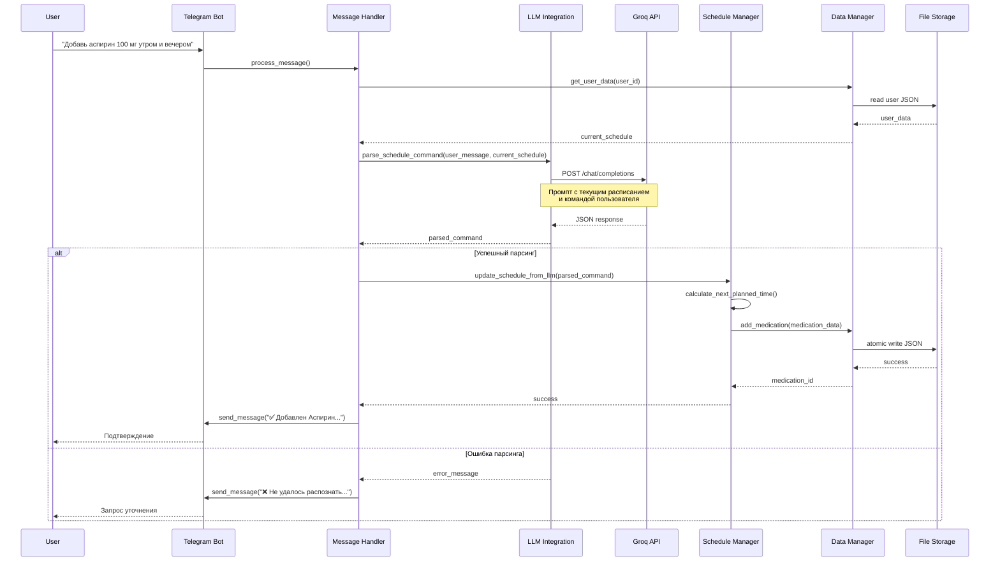
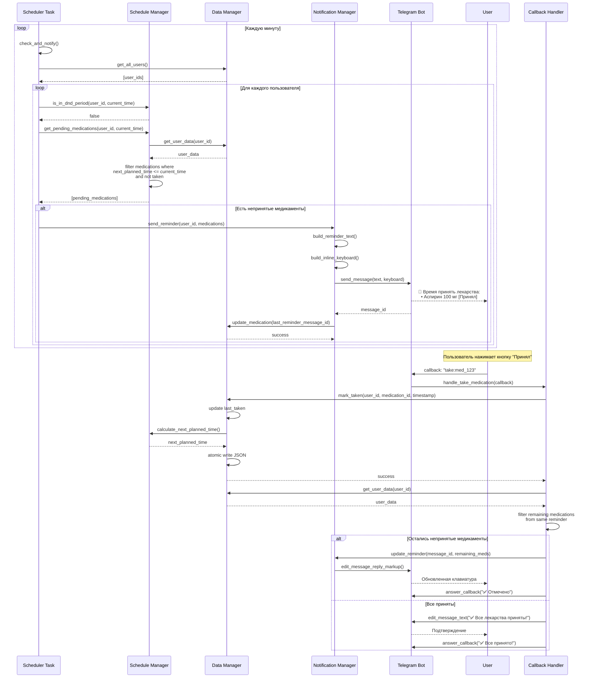
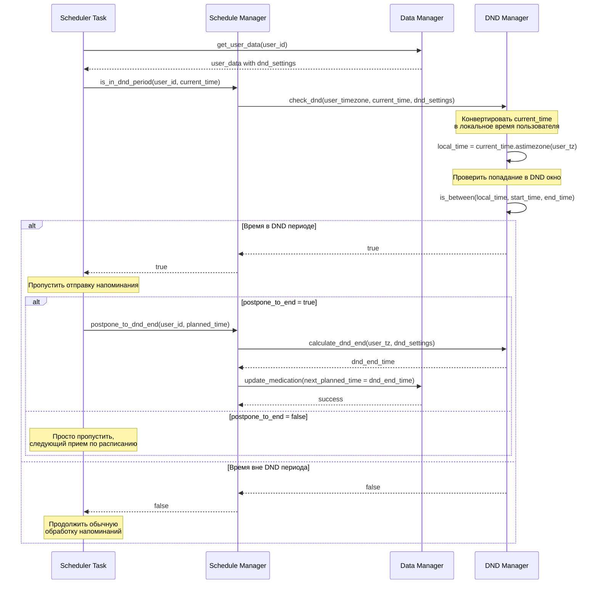
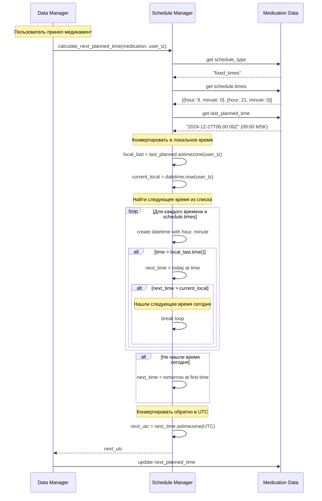
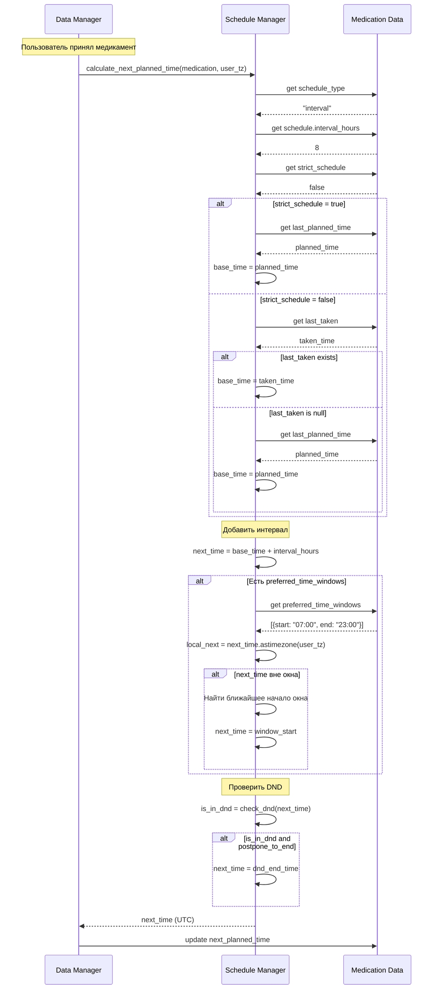
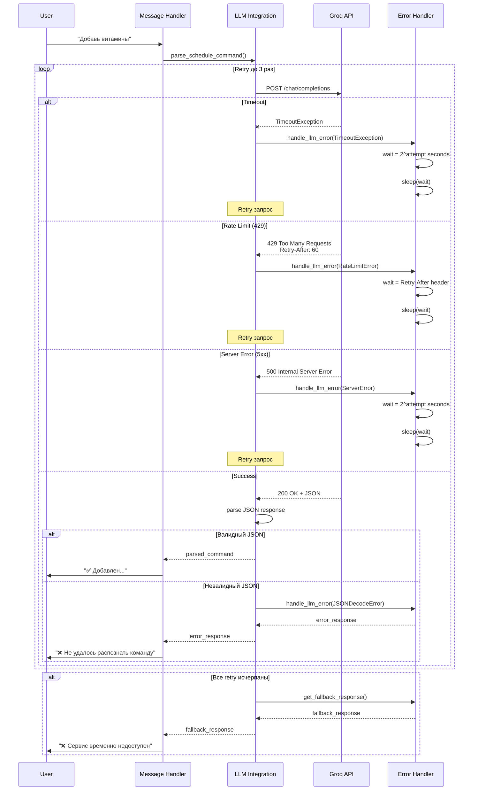
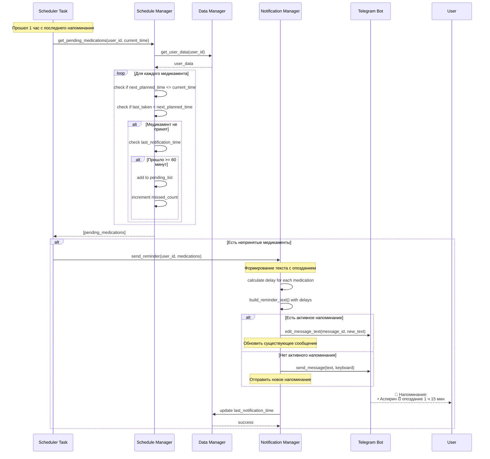
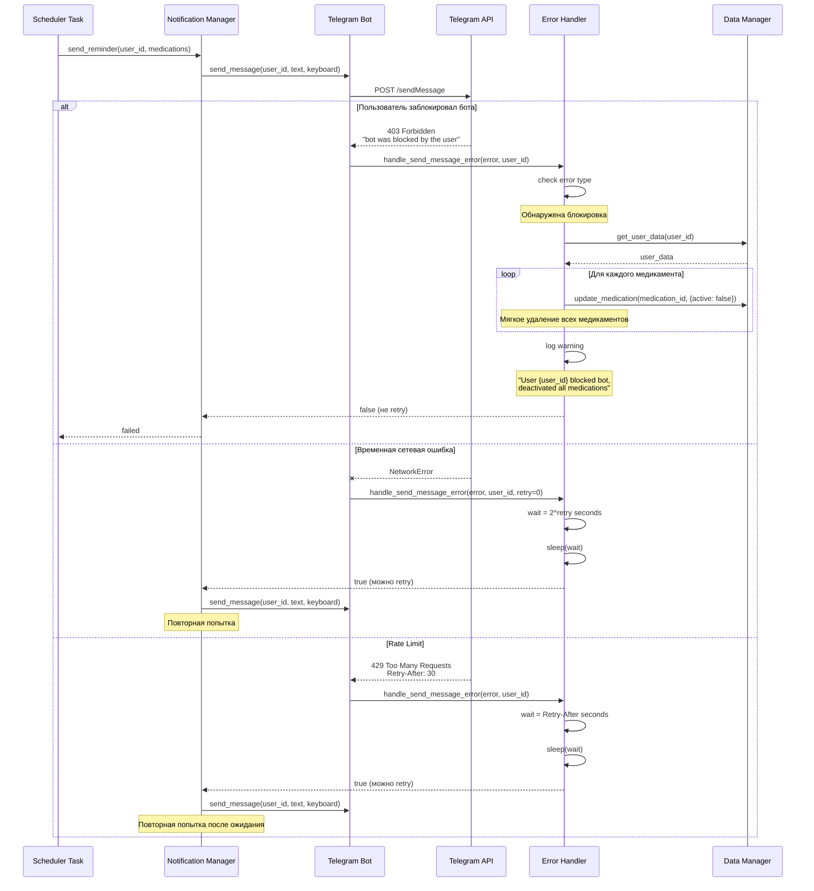

# Диаграммы последовательности для ключевых сценариев

## Сценарий 1: Добавление медикамента через LLM

---

## Сценарий 2: Отправка напоминания и подтверждение приема

---

## Сценарий 3: Обработка DND режима

---

## Сценарий 4: Расчет следующего времени приема (fixed_times)

---

## Сценарий 5: Расчет следующего времени приема (interval)

---

## Сценарий 6: Обработка ошибки LLM API

---

## Сценарий 7: Повторные напоминания

---

## Сценарий 8: Обработка блокировки бота пользователем

---

## Легенда

### Участники
- **U (User)**: Пользователь Telegram
- **TG (Telegram Bot)**: Telegram Bot клиент (aiogram)
- **MH (Message Handler)**: Обработчик текстовых сообщений
- **CH (Callback Handler)**: Обработчик callback-запросов
- **LLM (LLM Integration)**: Модуль интеграции с LLM
- **GROQ (Groq API)**: Внешний API Groq
- **SM (Schedule Manager)**: Менеджер расписаний
- **DM (Data Manager)**: Менеджер данных
- **FS (File Storage)**: Файловое хранилище JSON
- **NM (Notification Manager)**: Менеджер уведомлений
- **SCH (Scheduler Task)**: Фоновый планировщик
- **DND (DND Manager)**: Менеджер режима "Не беспокоить"
- **EH (Error Handler)**: Обработчик ошибок
- **TAPI (Telegram API)**: Внешний API Telegram

### Обозначения
- `-->>`: Синхронный ответ
- `->>`: Синхронный вызов
- `--x`: Ошибка
- `Note over`: Комментарий
- `alt/else/end`: Условное ветвление
- `loop/end`: Цикл
